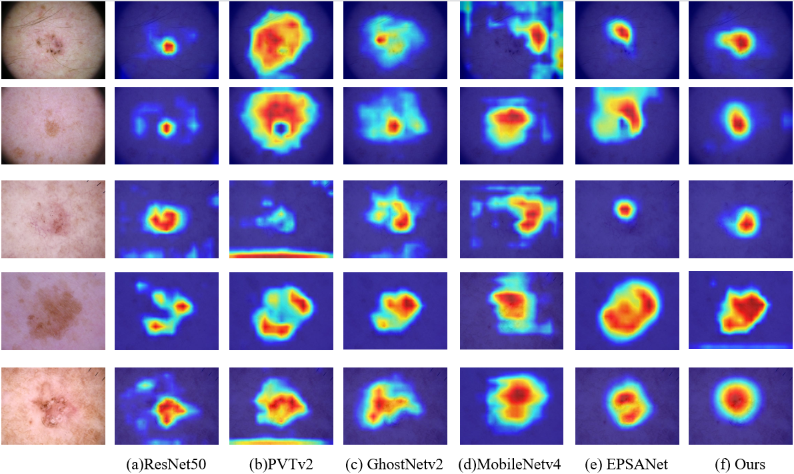
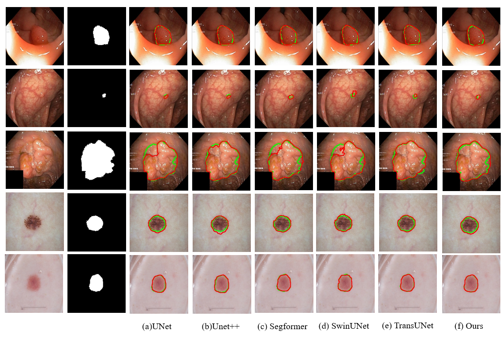

# MFSF2-NET
MFSF2-NET:Towards Improved Skin Lesion Diagnosis via Multi-Scaleand Multi-Frequency-Domain Fusion
<!-- Badges (CI, License, PyPI) can go here -->

## 📖 Overview  
This repository implements the network proposed in “MFSF2-NET:Towards Improved Skin Lesion Diagnosis via Multi-Scaleand Multi-Frequency-Domain Fusion” (2025). Our model addresses both classification and segmentation by:

1. **Dual-Branch Feature Extraction**: The two branches (ResNet branch and PVT branch) extract different features respectively  
2. **Multi-Frequency Awareness Fusion (MFAF)**: DCT-based decomposition to capture informative high- and low-frequency components. 
3. **Pyramid Multi-Scale Fusion (PMSF)**: Hierarchical fusion module that integrates multi-frequency features across scales into a cohesive representation.
## 🏗️ Architecture Diagram

*Figure 1. MFSF²‑NET diagram.*

## 🎯 Key Features  
- ✅ New P‑SinkD dataset: multisource dermoscopy & CT images
- ✅ Classification on HAM10000 & ISIC2019 datasets  
- ✅ Segmentation on ISIC2018 & Kvasir‑SEG datasets  
- ✅ Configurable training and evaluation scripts  

## 📂 Datasets
All datasets are split in an 8:1:1 ratio for training, validation, and testing.

**Classification Datasets**

HAM10000: 10,015 dermoscopic images across seven categories.

ISIC2019: Over 25,000 dermoscopic images covering melanoma and non-melanoma.

P‑SinkD (Private): 836 dermoscopic + 3,344 reflectance confocal microscopy (RCM) images from 532 patients (Wuxi Second People’s Hospital, 2018–2024). Annotation by three board-certified dermatologists; consensus labels.

*Figure 2. Dataset visualization.*

**Segmentation Datasets**

ISIC2018: 2,594 dermoscopic images with lesion masks.

Kvasir‑SEG: 1,000 polyp images with segmentation masks.

**Results**

*Figure 3. Classification result.*

*Figure 4. Segmentation result.*

## 🔧 Future Updates

This repository will be continuously updated with new features, optimizations, and expanded dataset support.
