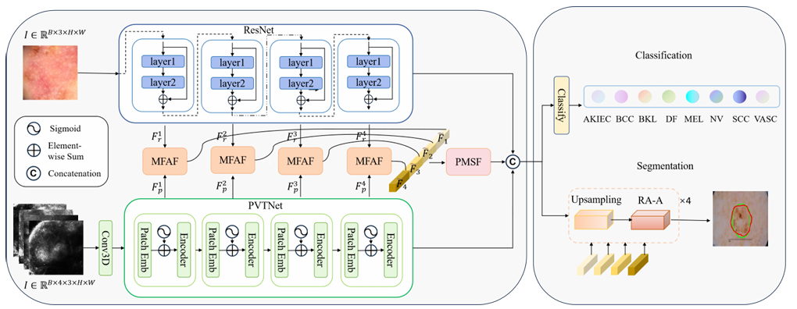
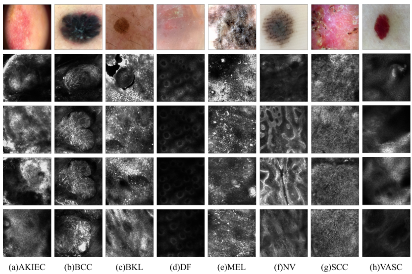

# MultiFreq2Scale‑Fusion  
A unified multi-frequency–multi-scale network for multimodal medical image feature fusion

<!-- Badges (CI, License, PyPI) can go here -->

## 📖 Overview  
This repository implements the network proposed in “A Unified Multi‑Frequency–Multi‑Scale Network for Multimodal Medical Image Feature Fusion” (2025). Our model addresses both classification and segmentation by:

1. **Dual‑Branch Alignment**: Aligning ResNet and PVTNet feature maps via bilinear interpolation + 3×3 convolution, combining global and local representations.  
2. **Multi‑Frequency Feature Extraction (MFFE)**: Applying DCT basis filters to aligned features to extract complementary frequency details.  
3. **Multi‑Frequency & Multi‑Scale Fusion**: Cross-frequency and cross-scale fusion of global and local features, followed by concatenation + Conv+BN+ReLU for final feature reassembly.  
## 🏗️ Architecture Diagram

## 🎯 Key Features  
- ✅ New P‑SinkD dataset: multisource dermoscopy & CT images
- ✅ Classification on HAM10000 & ISIC2019 datasets  
- ✅ Segmentation on ISIC2018 & Kvasir‑SEG datasets  
- ✅ Configurable training and evaluation scripts  

## 📂 Datasets
All datasets are split in an 8:1:1 ratio for training, validation, and testing.

**Classification Datasets**

HAM10000: 10,015 dermoscopic images across seven categories.

ISIC2019: Over 25,000 dermoscopic images covering melanoma and non-melanoma.

P‑SinkD (Private): 836 dermoscopic + 3,344 reflectance confocal microscopy (RCM) images from 532 patients (Wuxi Second People’s Hospital, 2018–2024). Annotation by three board-certified dermatologists; consensus labels.

**Segmentation Datasets**

ISIC2018: 2,594 dermoscopic images with lesion masks.

Kvasir‑SEG: 1,000 polyp images with segmentation masks.

## 🔧 Future Updates

This repository will be continuously updated with new features, optimizations, and expanded dataset support.
